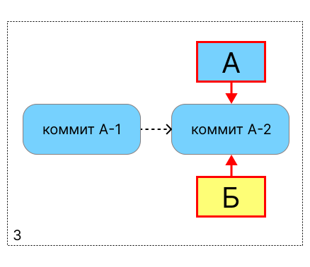
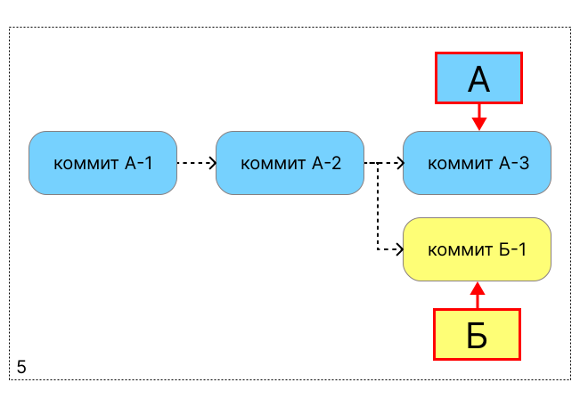
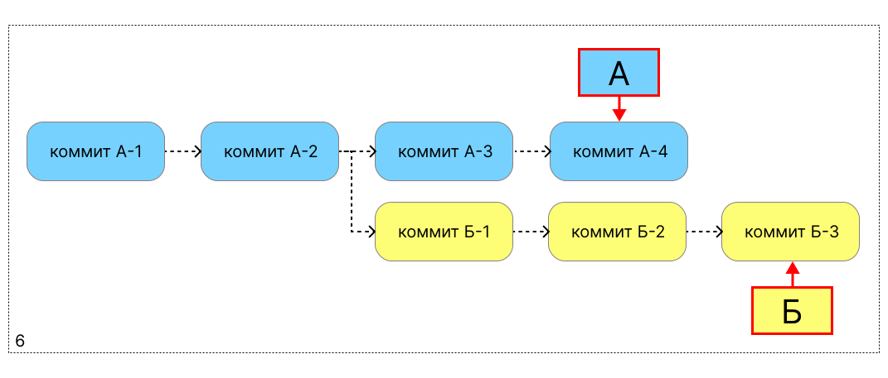
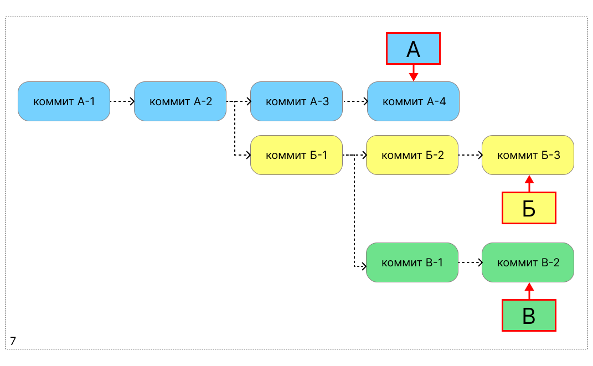
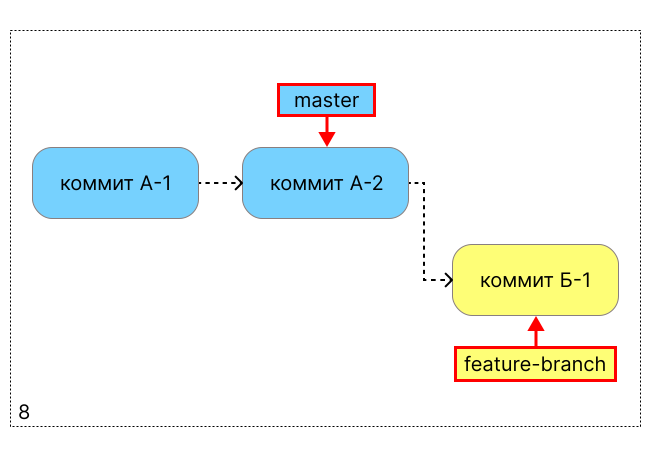
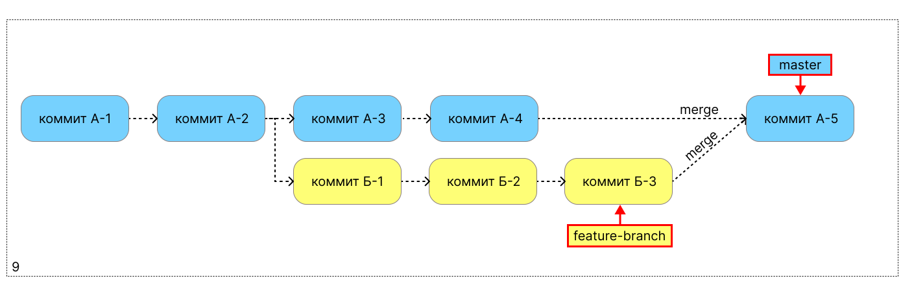

# Как работает GIT

Любая система контроля версий по сути является набором контрольных точек, каждая такая точка хранит информацию о файлах и изменениях, которые были внесены в эти файлы с момента создания предыдущей контрольной точки.

Гит при создании контрольной точки «фотографирует» проект, запоминая, как выглядит каждый файл. Если файл с момента последней фотосессии никак не изменился, гит не станет его фиксировать, а просто сошлётся на снимок с прошлой контрольной точки. Вся информация в системе хранится именно в виде таких снимков состояния файлов.

Этот снимок называется **коммит** (commit), и мы создаём его каждый раз, когда хотим сохранить наши изменения.

Мы можем свободно переключаться между коммитами и просматривать разные версии проекта. В каждом активном проекте скапливается огромное количество коммитов, в которых нужно как-то ориентироваться. Для этого в гите есть специальные указатели, которые выведут нас на нужный коммит.

Изначально в проекте только один указатель, который находится на самом первом коммите. Создавая новый коммит, мы перемещаем указатель на него:


А теперь представим, что нам нужно сделать новую версию какого-нибудь файла проекта. Для этого сначала создадим новый указатель. Теперь оба наших указателя находятся на последнем коммите:



Переключимся на новый указатель, отредактируем файл и зафиксируем изменения новым коммитом. Указатель Б переместился на новый коммит, а указатель А остался на прошлом коммите:


Поздравляю! Теперь у нас есть две параллельные версии файла, между которыми мы можем спокойно переключаться. Например, мы хотим сделать какие-то изменения в версии А. Вернёмся на указатель А, отредактируем файл и создадим новый коммит:



Указатель А переместился на новый коммит. Таким образом, у нас начали выделяться две параллельные цепочки коммитов под двумя разными указателями. Эти цепочки параллельны и независимы друг от друга. Например, мы можем вернуться на указатель Б и создать там ещё два коммита, а потом переключиться на указатель А и добавить один коммит:



При необходимости мы можем выбрать какой-нибудь из имеющихся у нас коммитов, создать от него ещё один указатель и повести третью параллельную цепочку:



Каждый новый указатель ответвляется от выбранного коммита и ведёт за собой новую цепочку коммитов. Такие указатели, а также цепочки коммитов, которые тянутся за ними, называются **ветками** (branch).

В каждом проекте по умолчанию есть одна главная ветка, которую обычно называют `master` или `main`. Как правило, главная ветка содержит в себе актуальную версию проекта, его чистовик. Когда мы хотим внести изменения, мы не вносим правки сразу в чистовик, а используем черновик: создаём новую ветку от мастер-ветки и работаем внутри неё.



После того, как работа на черновике проверена, мы можем перенести её на чистовик: влить новую ветку обратно в мастер-ветку. Такая процедура в гите называется **слиянием** (merge):



Внутри проекта может быть создано сколько угодно веток — между ними можно свободно переключаться, объединять их друг с другом, переносить отдельные коммиты из одной ветки в другую и выполнять много других полезных операций. Всё это позволяет наладить командную работу и выполнять несколько задач параллельно.

Все операции с файлами в гит можно выполнять в терминале с помощью специальных команд.

## Необходимый минимум команд

#### Клонирование репозитория `git clone`

Клонирование репозитория — это создание локальной копии репозитория на устройстве пользователя для дальнейшей работы с файлами репозитория.

1. Откройте удалённый репозиторий в GitHub.
2. На вкладке «Code» нажмите кнопку **Code**.
3. В выпадающем окне перейдите на **Local → HTML** и скопируйте ссылку на репозиторий.
4. Выберите на вашем устройстве папку, в которую вы хотите поместить локальный репозиторий.
5. Откройте командную строку в этой папке и выполните команду для клонирования репозитория:

    ```bush
    git clone ссылка-на-репозиторий-из-пункта-3
    ```

    !!! quote "Как открыть нужную папку в командной строке?"
        Для перехода в нужную папку через командную строку используйте команду `cd путь-до-папки`:

        ```bush
        cd C:\Users\User-1\folder-for-repo
        ```

#### Настройка параметров конфигурации git `git config`

Установите имя пользователя и электронный адрес:

```
git config --global user.email my-address@mail.com
git config --global user.name "Anton.Gafarov"
```

Этими данными по умолчанию будут подписываться все сделанные вами коммиты.

Вы можете задать отдельные имя пользователя и электронную почту для определённого репозитория. Для этого перейдите в локальный репозиторий и выполните команды `git config` без флага `--global`:

```
git config user.email new-address@mail.com
git config user.name "Superman"
```

#### Просмотр текущего состояния репозитория `git status`

Команда `git status` отображает активную локальную ветку, состояние файлов в рабочей папке и в индексе: какие изменения ещё не добавлены в индекс, а какие уже готовы к коммиту.

#### Обновление локального репозитория

Для работы с изменениями удалённого репозитория используются команды `git fetch` и `git pull`.

Команда `git fetch` загружает последние изменения из удалённого репозитория, но не вливает их в локальные ветки, то есть не обновляет локальный репозиторий и не изменяет файлы в нём. Команду `git fetch` можно использовать для безопасного просмотра обновлений удалённого репозитория «без последствий», например, чтобы посмотреть новые ветки и проанализировать работу коллег.

Команда `git pull` загружает последние изменения из удалённого репозитория и вливает их в локальные ветки, то есть обновляет состояние локального репозитория, синхронизируя его с удалённым репозиторием. Команду `git pull` используют в случаях, когда для работы необходимо использовать актуальную версию проекта.

#### Переключение между ветками

Для переключения на ветку используйте команду `git switch название-ветки` или `git checkout название-ветки`.

#### Создание новой ветки

Как правило новая ветка создаётся для выполнения очередной задачи по обновлению проекта, поэтому ветка откалывается от главной ветки репозитория (main или master):

1. Переключитесь на главную ветку репозитория:

    ```
    git switch master
    ```

2. Заберите возможные обновления из удалённого репозитория:

    ```
    git pull
    ```

3. Создайте новую ветку. По умолчанию ветка откалывается от текущей ветки (в нашем случае от master-ветки):

    ```
    git branch new-feature
    ```

4. Переключитесь на новую ветку:

    ```
    git switch new-feature
    ```

    !!! note "Примечание"
        Последние два действия (создание ветки и переключение на неё) можно выполнить одной командой:

        ```
        git checkout -b new-feature
        ```

#### Сохранение изменений

Внесённые вами в файлы изменения находятся в рабочей директории. Перед созданием коммита необходимо добавить эти изменения в индекс — промежуточное пространство с метаданными об изменениях:

1. Убедитесь, что изменения есть в рабочей директории:

    ```bash
    git status
    ```

    Непроиндексированные файлы указаны под заголовком `Changes not staged for commit`:

    ```title="Пример"
    git status
    On branch new-feature

    Changes not staged for commit:
      (use "git add <file>..." to update what will be committed)
      (use "git restore <file>..." to discard changes in working directory)
            modified:   docs/git-for-tech-writer.md

    no changes added to commit (use "git add" and/or "git commit -a")
    ```

2. Добавьте изменения в индекс. Для этого выполните команду `git add`:

    !!! note "Примечание"
        Чтобы добавить один файл в индекс, укажите в команде `git add` полное название файла:

        ```
        git add docs/git-for-tech-writer.md
        ```

        Чтобы добавить в индекс все изменённые файлы, вместо названия файла в команде `git add` поставьте точку:

        ```
        git add .
        ```

    Если после `git add .` выполнить команду `git status`, можно увидеть, что проиндексированные изменения теперь отображаются под заголовком `Changes to be commited`:

    ```title="Пример"
    git add .
    git status
    On branch new-feature

    Changes to be committed:
    (use "git restore --staged <file>..." to unstage)
        modified:   docs/git-for-tech-writer.md
    ```

3. Создайте коммит с помощью команды `git commit -m "Описание коммита"`:

    ```title="Пример"
    git commit -m "Добавил статью с git-командами"
    ```

#### Публикация новой ветки

Чтобы ваша локальная ветка `new-feature` появилась в удалённом репозитории и была доступна остальным участникам проекта, нужно создать её удалённую версию и связать их друг с другом.

Для этого используйте команду `git push` с флагом `--set-upstream`:

```
git push --set-upstream origin new-feature
```

В результате выполнения этой команды в удалённом репозитории `origin` создаётся ветка `origin/new-feature`, которая связывается с вашей локальной веткой `new-feature`. Теперь вы можете свободно выполнять команды `git pull` и `git push` в ветке `new-feature` — гит будет знать, из какой именно удалённой ветки забирать изменения при `git pull` и в какую удалённую ветку отправлять изменения при `git push`.

#### Отправка изменений на сервер

Для отправки коммитов уже опубликованной ветки в удалённый репозиторий используйте команду `git push`.

#### Слияние веток

Для слияния двух веток используйте команду `git merge`:

1. Переключитесь на целевую ветку (целевая — ветка, в которую будут вливаться изменения):

    ```title="Пример"
    git switch base-branch
    ```
2. Выполните команду `git merge название-сливаемой-ветки`:

    ```title="Пример"
    git merge compared-branch
    ```

3. Отправьте изменения целевой ветки в удалённый репозиторий с помощью команды `git push`.

#### Просмотр истории изменений

* Для просмотра истории коммитов выполните команду `git log`. В ответе отобразится список коммитов:

    ```title="Пример"
    git log
    commit dfa4ed84ce580cb60967d976e11cdfd1453a1183 (HEAD -> git-homework, origin/git-homework)
    Author: parawriter <novillero@yandex.ru>
    Date:   Sat Jan 17 11:00:11 2026 +0300

        создание страницы с git-командами
    ```

    Для просмотра следующих пунктов списка нажимайте клавишу **Enter**. Для выхода из команды `git log` нажмите клавишу **q**.

* Для просмотра полной информации о конкретном коммите используйте команду `git show`с указанием хэша коммита:

    ```title="Пример"
    git show dfa4ed84ce580cb60967d976e11cdfd1453a1183

    Author: parawriter <novillero@yandex-team.ru>
    Date:   Sat Jan 17 11:00:11 2026 +0300

    создание страницы с git-командами

    diff --git a/docs/git-for-tech-writer.md b/docs/git-for-tech-writer.md
    new file mode 100644
    ```

    ??? quote "Что такое хэш коммита?"
        Хэш коммита — это его уникальный идентификатор, состоящий из сорока символов (или его укороченная версия из семи символов). Хэш коммита можно посмотреть в выводе команды `git log`:

        ```title="Пример"
        git log
        commit dfa4ed84ce580cb60967d976e11cdfd1453a1183 # хэш коммита
        Author: parawriter <novillero@yandex-team.ru>
        Date:   Sat Jan 17 11:00:11 2026 +0300
        ```

* Для просмотра последних изменений используйте команду `git diff`. Команда покажет разницу между текущим состоянием рабочей директории и последним коммитом:

    ```title="Пример"
    git diff

    diff --git a/docs/git-for-tech-writer.md b/docs/git-for-tech-writer.md
    index cb9bc44..04b1455 100644
    --- a/docs/git-for-tech-writer.md
    +++ b/docs/git-for-tech-writer.md
    @@ -90,20 +90,53 @@
         git status
         ```

    -    Непроиндексированные файлы выделены красным цветом:
    +    Непроиндексированные файлы указаны под заголовком `Changes not staged for commit`:

    -```git
    -PS C:\Users\79600\parawriter\dac-advanced> git status
    -On branch git-homework
    -Your branch is up to date with 'origin/git-homework'.
    ```

#### Отмена изменений

* Для отмены непроиндексированных изменений в файле используйте команду `git restore название-файла`. Изменения в файле будут безвозвратно удалены.

* Для отмены проиндексированных изменений в файле используйте команду `git restore --staged название-файла`. Изменения в файле сохранятся, но будут удалены из индекса.

* Для отмены локального коммита (который ещё не отправили в удалённый репозиторий) используйте команду `git reset`:

    ```
    git reset HEAD~1
    ```

    В результате выполнения этой команды указатель HEAD переместится на предыдущий коммит, а изменения из текущего коммита окажутся в рабочей директории.

    !!! info "Важно!"
        Не используйте команду `git reset` для коммитов, которые вы уже отправили на удалённый сервер.

* Для отмены коммита, отправленного в удалённый репозиторий, используйте команду `git revert хэш-коммита`.

    !!! note "Примечание"
        Команда `git revert` не удаляет коммит, а отменяет внесённые в нём изменения и фиксирует это новым коммитом.

#### Просмотр веток

Для просмотра всех веток локального репозитория используйте команду `git branch`.

Для просмотра всех веток удалённого репозитория используйте команду `git branch` с флагом `-r`:

```
git branch -r
```

#### Удаление веток

=== "Локальная ветка"

    Для удаления локальной ветки:

    1. Переключитесь на другую ветку.
    2. Выполните команду:

        ```
        git branch --delete название-ветки
        ```

    !!! info "Внимание!"
        Команда `git branch --delete` удаляет только локальную версию ветки и не влияет на опубликованную в удалённом репозитории ветку, которую нужно удалить отдельно.

=== "Удалённая ветка"
    
    Для удаления удалённой ветки выполните команду:

    ```
    git push origin --delete название-ветки
    ```


