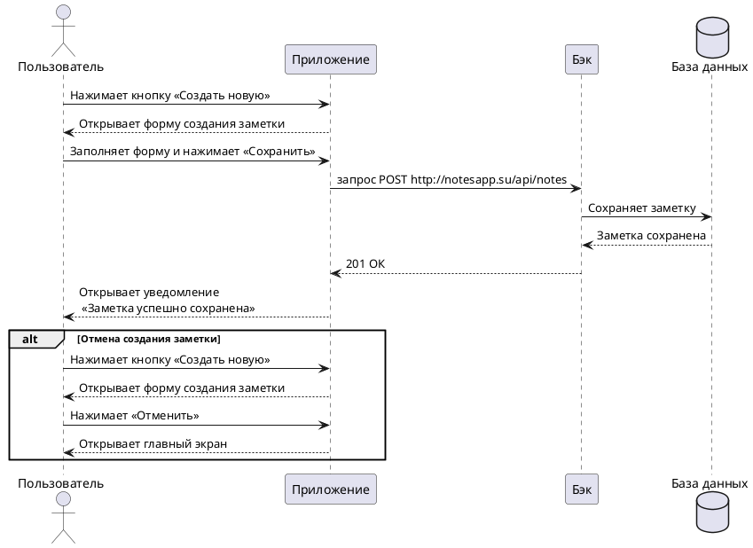

# Пользовательский сценарий «Создание новой заметки»

### Действующие лица:

1. Пользователь
2. Приложение
3. Бэк
4. База данных

### Предварительные условия

Пользователь должен находиться на главном экране.

### Выходные условия

В системе появилась новая заметка пользователя.

### Основной сценарий

1. Пользователь нажимает кнопку **Создать новую**.
2. Приложение открывает окно с формой создания новой заметки.
3. Пользователь заполняет форму заметки.
4. Пользователь нажимает кнопку **Сохранить**
5. Приложение отправляет запрос `POST http://notesapp.su/api/notes` Бэку на сохранение новой заметки.
6. Бэк сохраняет заметку в Базе данных.
7. Бэк возвращает Приложению ответ 201 «Заметка успешно создана».
8. Приложение открывает пользователю уведомление «Заметка успешно сохранена».

### Альтернативный сценарий

1. Пользователь нажимает кнопку **Создать новую**.
2. Приложение открывает окно с формой создания новой заметки.
3. Пользователь заполняет форму заметки.
4. Пользователь нажимает кнопку **Отменить**
5. Приложение открывает пользователю главный экран.

### Диаграмма последовательности



??? note "Код диаграммы"
    ```plantuml
    @startuml
    actor Пользователь
    participant Приложение
    participant Бэк
    database "База данных"

    Пользователь -> Приложение: Нажимает кнопку «Создать новую»
    Пользователь <-- Приложение: Открывает форму создания заметки
    Пользователь -> Приложение: Заполняет форму и нажимает «Сохранить»
    Приложение -> Бэк: запрос POST http://notesapp.su/api/notes
    Бэк -> "База данных": Сохраняет заметку
    Бэк <-- "База данных": Заметка сохранена
    Бэк --> Приложение: 201 ОК
    Приложение --> Пользователь: Открывает уведомление\n «Заметка успешно сохранена»

    alt Отмена создания заметки
    Пользователь -> Приложение: Нажимает кнопку «Создать новую»
    Пользователь <-- Приложение: Открывает форму создания заметки
    Пользователь -> Приложение: Нажимает «Отменить»
    Приложение --> Пользователь: Открывает главный экран
    end alt

    @enduml
    ```

